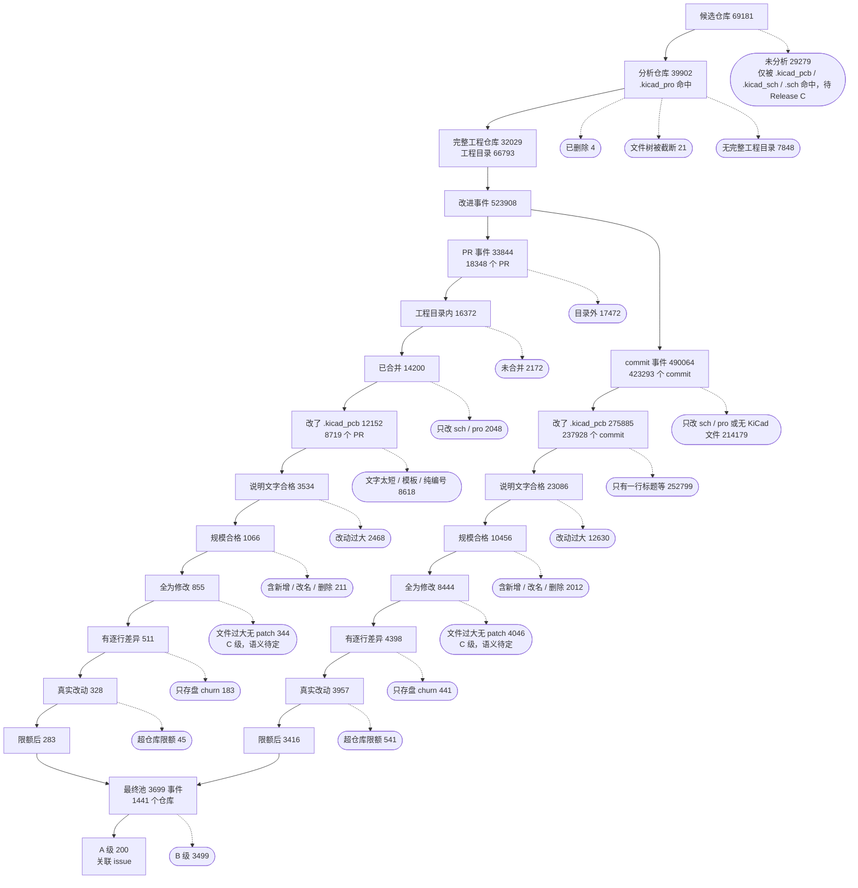

# 开源 PCB 工程挖掘与改进事件提取：进展报告

日期：2026-09-04

**背景与术语**

设计一块电路板要用 EDA 软件，KiCad 是最流行的开源 EDA 软件。一个 KiCad 工程由三类核心文件组成：

​	`.kicad_pro` 是工程文件（相当于项目清单），

​	`.kicad_sch` 是原理图（电路的逻辑连接），

​	`.kicad_pcb` 是布局布线文件（元件在板上的位置和走线）。

2021 年底发布的 KiCad 6 引入了这套后缀；更早的版本原理图用 `.sch`，与其他软件的后缀相同。

GitHub 是代码托管平台。一个仓库（repo）是一个项目；提交（commit）是一次保存的改动；PR（pull request）是一次带说明的改动提议，合并后进入正式版本；issue 是问题或需求讨论帖。

项目仓库地址：https://github.com/Xiafyjck/github_kicad_project_scout

数据集地址：https://modelscope.cn/datasets/Mask2X/pcb-project-scout

**目标**

找出 GitHub 上所有开源 PCB 工程，并从中提取"一次有说明的 PCB 设计改进"，用于制作 benchmark，评测 AI 修改电路的能力：改动前的工程是输入，改动后的工程是参考答案，PR 或 issue 里的文字是题面。

**方法**

整条流水线分四段：找仓库、判完整、拉历史、筛事件。每段的策略和取舍如下。

1. **候选策略：多后缀代码搜索取并集**

用 GitHub 代码搜索按文件后缀找仓库。搜索接口有三个硬限制：只索引 384 KB 以下的文件；单条查询最多返回 1000 条；结果不保证完整。应对办法：

- 按文件大小二分。一条查询带 `size:a..b` 区间，若第一页就满 100 条，说明区间太密，切成两半继续，直到每个区间都能被 10 页 1000 条完整枚举，或区间收窄到单一字节数（这时封顶，少量文件放弃）。`.kicad_pro` 最终切成 3224 个区间，`.sch` 切成 8914 个。
- 四种后缀分别搜。`.kicad_pro` 文件最小，几乎全在索引内，是最可靠的入口；`.kicad_pcb` 近半数超过 384 KB，用它只能找到 43% 的完整工程；`.kicad_sch` 介于两者之间；`.sch` 兜住 KiCad 5 及更早版本。四路结果按仓库 id 去重取并集，保留每个仓库被哪几路命中、命中了哪些文件。
- 不信搜索，信文件树。搜索只用来发现仓库，仓库里到底有什么、工程是否完整，一律以后面拉的完整文件列表为准。

2. **完整工程判定：只看文件树**

对每个仓库用 Tree API 拉一次完整递归文件列表（一次请求拿全仓库）。判定规则纯本地：同一目录下同时存在 `.kicad_pro`、`.kicad_pcb`、`.kicad_sch`，且该目录、其上级目录或仓库根目录有 README，记为一个工程目录。不看文件内容，不判断工程能否打开。文件数过多导致 API 截断的 21 个仓库直接放弃，它们多是大型杂项集合，逐个下载源码包补全成本高于收益。

3. **历史拉取策略：先全量拉原始响应，再本地判断**

拉取脚本只缓存原始 API 响应，不做任何业务判断；所有筛选规则都在本地重算，改规则不消耗配额。按成本从低到高分四步：

- 活跃度统计用 GraphQL，一次查询 25 个仓库，拿默认分支提交数、PR 数、issue 数、star、fork、是否归档等，4 万仓库只用 1597 次请求。
- 每个仓库拉四类列表全部分页：按工程目录查询的提交列表（只拿触及该目录的提交，避免整库历史）、全部 PR、每个 PR 的改动文件、全部 issue。PR 的改动文件接口自带逐行差异，这是后面判断"改了什么"的依据。
- 提交列表接口不返回改动文件，所以再对触及工程目录的 42.3 万个提交逐个拉 `commits/{sha}`，拿到与 PR 同样的文件明细。
- 全部候选仓库都拉，不预先按活跃度筛，为的是筛选规则可以事后随意调整。

4. **事件构建策略：一次改动 × 一个工程目录**

改动的最小单位定为事件：一个 PR 或 commit 改了哪些 KiCad 文件，落在哪个工程目录，就记一条。PR 事件的改动前状态是 base 分支的 commit，改动后是合并 commit（GitHub 列表接口常不返回，退回用 PR 分支头）；commit 事件的改动前是第一个父提交，改动后是它自己。每条事件记录改动的 KiCad 文件清单及其状态（新增 / 修改 / 改名 / 删除）、增删行数、按 pcb / sch / pro 的计数，以及说明文字里 `#N` 引用并确认存在的 issue。

5. **后处理策略：五道筛 + 分级**

底线是"已合并、落在工程目录内、改了 `.kicad_pcb`"。在此之上每道筛只解决一个问题：

- 文字筛解决"有没有题面"。标题加正文去掉 checklist、HTML 注释、引用、签名后至少 100 字；PR 模板、TODO 清单、只有 issue 编号或链接的都不算。这是损失最大的一道，因为多数提交只有一行标题。
- 规模筛解决"改动是不是一次可理解的修改"。KiCad 文件增删行合计不超过 8000、改动文件不超过 40，排除整批重导入、版本升级、脚本生成。阈值定得宽，因为一次小的布局改动就会改写上千行。
- 修改筛解决"前后状态能不能对上"。所有 KiCad 文件必须是 modified，新增没有"改动前"，改名和删除对不上文件。
- 存盘筛解决"是不是真改了电路"。KiCad 每次保存会重排 uuid、改版本号和时间戳，逐行差异里这类行不算数；剩下的真实改动行至少 5 行才保留。这是网表比较的代理，真正的判断要解析完整文件。
- 限额筛解决"少数仓库垄断"。每个仓库最多 20 条，先取有 issue 关联的，再按说明长度排。

通过全部筛的事件为 B 级，其中说明文字引用了本仓库 issue 的升为 A 级；因文件过大 GitHub 未返回逐行差异、无法做存盘筛的为 C 级待定；其余排除。

6. **发布策略：发原始缓存，不发加工结果**

各阶段的 SQLite 原样压缩发布，布局与本地缓存一致，附带每库的 sha256 与表行数。别人恢复后整条流水线不再需要 GitHub API，可以从任何一步改规则重算。

**统计口径**

报告里出现的集合逐层收窄，每个名字对应一个明确的筛法和数量：

| 名称 | 定义 | 数量 |
|---|---|---|
| 候选仓库 | 四种后缀（`.kicad_pro`、`.kicad_pcb`、`.kicad_sch`、`.sch`）的代码搜索命中的仓库取并集 | 69181 个仓库 |
| KiCad 6+ 候选仓库 | 候选仓库中被前三种后缀任一命中的 | 50796 个仓库 |
| 分析仓库 | 第一版搜索、由 `.kicad_pro` 命中的仓库；本报告后续所有数字都在这个集合上统计 | 39902 个仓库（其中 4 个已删除无文件树，7 个已删除无统计，21 个文件树被 GitHub 截断而忽略） |
| 工程目录 | 分析仓库内同时含 `.kicad_pro`、`.kicad_pcb`、`.kicad_sch`，且本目录、上级目录或仓库根目录有 README 的目录 | 66793 个目录 |
| 完整工程仓库 | 至少有一个工程目录的分析仓库 | 32029 个仓库（80%） |
| KiCad PR | 分析仓库的 PR 中，改动文件列表含任一 KiCad 文件的，不限目录、不限是否合并 | 18348 个 PR，4418 个仓库（全部 PR 140678 个） |
| 工程目录提交 | 用"按目录查询提交"接口，对每个工程目录取到的提交，按仓库去重 | 423293 个 commit（分析仓库默认分支提交总数 3387390 个，未逐条拉取） |
| 改进事件 | 一次 KiCad PR 或工程目录提交 × 它改动的一个工程目录；一个 PR 改了 3 个目录记 3 个事件。每个事件带改动前后版本、改动的 KiCad 文件清单、按 pcb / sch / pro 的文件数、逐行差异、引用的 issue | 523908 个事件（PR 事件 33844，commit 事件 490064） |
| 底线事件 | 改进事件中：落在工程目录内、PR 已合并（commit 不要求）、改动了至少一个 `.kicad_pcb` | PR 事件 12152（对应 8719 个 PR、3022 个仓库）；commit 事件 275885（对应 237928 个 commit、31972 个仓库） |
| 最终池 | 底线事件再过质量过滤：说明文字清洗后 ≥ 100 字且非模板 / TODO / 纯 issue 号；KiCad 改动行 ≤ 8000、改动文件 ≤ 40；KiCad 文件全为修改；逐行差异里有真实改动而非只存盘；每仓库最多 20 个 | 3699 个事件，1441 个仓库（PR 事件 283，commit 事件 3416） |
| A 级事件 | 最终池中说明文字明确引用了本仓库 issue 的 | 200 个事件，57 个仓库 |
| issue | GitHub 的 issue 接口把 PR 也算作 issue；本报告说的 issue 均已去掉 PR | 97849 个（接口返回 238233 条） |

筛网图：主干是保留的集合，虚线是每一层筛掉的部分及原因（数字为事件数，仓库层为仓库数）。

**结论**

1. **仓库规模**。通过 GitHub 代码搜索四种文件后缀，共发现 69181 个候选仓库，**其中 50796 个含 KiCad 6 及以后格式的文件**，18385 个只有旧格式 `.sch`。后续分析只覆盖 `.kicad_pro` 搜到的 39902 个。
2. **完整工程数量**。逐个拉取 39902 个仓库的完整文件列表后，**32029 个（80%）是完整工程仓库**，共 66793 个工程目录。其中 16977 个仓库附带 3D 模型文件（.step、.stl、.wrl 等），10492 个的模型放在工程目录内。
3. **仓库活跃度**。绝大多数是个人一次性项目：仓库提交次数中位数 16，PR、issue、star 中位数都是 0；80% 从未收到 PR，84% 从未有 issue。**有过合并 PR 的仓库 6897 个（17%）**。91% 的仓库创建于 2022 年之后，与 KiCad 6 发布同期；67% 在最近一年仍有更新。
4. **可追溯的改进历史（PR 层）**。39902 个仓库共 140678 个 PR，**其中 18348 个（13%）改动了 KiCad 文件，来自 4418 个仓库、5453 位作者**，已合并 15483 个。按合并年份，改动 KiCad 文件的已合并 PR 逐年翻倍：2022 年 1287，2024 年 3016，2025 年 4031，2026 年前 8 个月 3871。
5. **可追溯的改进历史（commit 层）**。触及工程目录的提交 423293 个，**其中 237928 个改动了 `.kicad_pcb`**。这些提交的改动文件全部拉取（887 万个文件），因此 commit 与 PR 有同样的文件明细。纯 issue 97849 个。
6. **改进事件**。把每次改动 KiCad 文件的 PR 或 commit 按工程目录拆成事件，共 523908 个（PR 事件 33844，commit 事件 490064），每条带改动前后的版本标识、改动的文件清单、按 pcb / sch / pro 的文件计数、逐行差异，以及文字里引用的 issue。以"已合并、落在工程目录内、改了 `.kicad_pcb`"为底线：**PR 事件 12152 个（对应 8719 个 PR、3022 个仓库），commit 事件 275885 个（对应 237928 个 commit、31972 个仓库）**。
7. **题库素材量**。对底线事件再做质量过滤：说明文字清洗后不少于 100 字且非模板、非 TODO、非纯 issue 编号；KiCad 改动行不超过 8000、改动文件不超过 40；KiCad 文件全为修改而非新增或改名；从逐行差异中剔除只有 uuid、时间戳、版本号变化的"只存盘"改动；每个仓库最多取 20 条。**最终池 3699 个事件，来自 1441 个仓库（PR 事件 283，commit 事件 3416），其中明确关联 issue 的 A 级 200 个**。另有 4390 个事件因文件过大 GitHub 未返回逐行差异，语义待定。各步骤的漏斗见 `reports/event_quality.md`。
8. **数据发布**。全部原始 API 缓存（95 GB，压缩后 8.2 GB）已作为 Release B 发布到 ModelScope，布局与本地缓存一致；用仓库里的恢复脚本下载后，整条流水线不再需要访问 GitHub API。

**TODO**

- [x] PR 的改动文件列表已拉完（140678 个 PR，345 万个改动文件）。
- [x] commit 的改动文件列表已拉完（423293 个 commit，887 万个改动文件）。commit 元数据和 commit 涉及的文件列表是两个接口。
- [x] 改进事件表与质量过滤。
- [x] Release B 发布到 ModelScope。
- [ ] 新增的 29279 个仓库（由 `.kicad_pcb`、`.kicad_sch`、`.sch` 搜到、但 `.kicad_pro` 搜索未命中）尚未拉文件列表、初筛和历史，拉完后发 Release C。
- [ ] 在改动前后的完整文件上解析 KiCad 的 S 表达式比较网表，替代目前基于逐行差异的"只存盘"启发式，并处理 4390 个无逐行差异的事件。
- [ ] 用 kicad-cli 对改动前后跑 DRC / ERC，错误数不增加的事件才留。
- [ ] 人工审阅 200 个 A 级事件（`reports/seed_issue_driven_prs.csv`），确定题型与出题模板。

**Note：具体实现**

1. **流程**。关键词搜索 → 仓库去重 → 拉取仓库文件树 → 初筛出完整工程仓库 → 拉活跃度统计 → 拉 commit / PR / PR 文件 / issue → 构建改进事件 → 拉 commit 改动文件 → 事件质量过滤。每一步是独立脚本，原始接口响应全部缓存到各自的 SQLite，断点可续，重跑不重复请求；筛选规则改动只动本地计算，不消耗接口配额。
2. **API 拉取量**。代码搜索 19344 页，文件树 39902 次，活跃度统计 1597 次（GraphQL，每次批量 25 个仓库），历史列表 321141 次，commit 文件 469455 次，合计约 85 万次。GitHub 限速：REST 每个 token 每小时 5000 次，脚本按 0.75 秒间隔约 4600 次；代码搜索每个 token 每分钟 10 次。后期 13 个 token 并行，全程未触发限流。耗时：代码搜索四个后缀约 8 小时，文件树约 4 小时，活跃度统计 1 小时，历史列表 5.5 小时，commit 文件约 10 小时。
3. **缓存占用**。代码搜索 8.3 GB，文件树 5.0 GB，历史列表 24.6 GB，commit 文件 50.3 GB，派生表 6.2 GB，合计 95 GB；zstd 压缩后 8.2 GB。体积大头是逐行差异，KiCad 文件是高度重复的文本，压缩比接近 10 比 1。
4. **搜索盲区**。GitHub 代码搜索只索引 384 KB 以下的文件，布局文件近半数超过此值，仅靠 `.kicad_pcb` 搜索只能找到 43% 的完整工程，`.kicad_pro` 文件最小、最可靠。因此按多后缀取并集，再以完整文件列表为准判定。另外单条查询最多返回 1000 条，少量分箱封顶，约 1 万个文件未枚举，估计多为重复的库或模板文件。

**不足**

1. 大部分 PR 是代码或文档修改，不是 PCB 修改：14 万 PR 中只有 13% 碰到 KiCad 文件；碰到 KiCad 文件的 commit 里，又有 87% 只有一行标题，没有可以当题面的说明。素材的瓶颈在文字，不在改动本身。
2. 逐行差异不等于设计改动：KiCad 每次存盘会重排 uuid、改版本号，目前只用行首 token 做启发式区分，真正的判断要解析文件比较网表。
3. 大文件没有逐行差异：GitHub 对过大的 `.kicad_pcb` 不返回 patch，4390 个事件语义待定，需要按版本标识取回完整文件。
4. 素材集中在少数活跃仓库，且部分是布线工具的测试仓库或练习仓库（如 kicad-tools、kicad_skills），限额只能缓解，仍需人工排除。
5. 深度分析只覆盖第一版搜索的 39902 个仓库，新增 29279 个仓库尚未处理。
